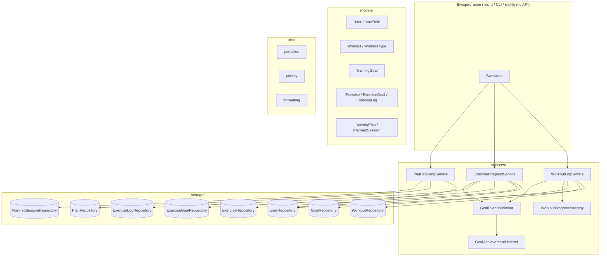

# Сервіс спортивних тренувань

[](https://github.com/feardelans/refactoring_proj/actions/workflows/ci-pipeline.yml?query=branch%3Amain)
[](https://sonarcloud.io/summary/new_code?id=feardelans_refactoring_proj)


In-memory бекенд для обліку тренувань, вправ, цілей, планів і прогресу спортсменів. Без зовнішньої БД і HTTP — дані живуть у репозиторіях протягом життя процесу (демо, тести, локальна консоль).

## Можливості

- **Журнал тренувань** — атлет записує сесії; тренер може записати за атлета.
- **Каталог вправ і прогрес** — реєстрація вправ, цілі по вправі, запис виконання, перегляд прогресу.
- **Цілі тренувань** — цільова кількість «одиниць прогресу»; оновлення після кожного запису тренування.
- **Плани тренувань** — створення плану, заплановані сесії (дата + тип), виконано/пропущено; збіг за датою й типом автоматично закриває сесію в плані.
- **Гнучкі правила прогресу** — рівномірні або вагові очки за типом тренування (патерн **Strategy**).
- **Досягнення цілей** — підписники отримують подію при виконанні цілі (патерн **Observer**).
- **Контроль доступу** — заблокований користувач не може логувати; перевірка ролі тренер/атлет.
- **Доменні утиліти** — штрафи за пропуск після серії, пріоритизація черги на слот.

## Архітектура

Шарова структура з інверсією залежностей: сервіси залежать від абстракцій, а не від конкретного сховища.



### Шари

| Шар | Відповідальність |
|-----|------------------|
| **`models`** | Доменні сутності та інваріанти (`Workout` незмінний; цілі валідують діапазони). |
| **`storage`** | Інтерфейси репозиторіїв (`Protocol`) та in-memory реалізації (`dict` / `list`). |
| **`services`** | Сценарії використання, стратегії прогресу, доменні події. |
| **`utils`** | Чисті функції: штрафи, черга, форматування рядків. |

### Патерни проєктування

| Патерн | Де | Навіщо |
|--------|-----|--------|
| **Strategy** | `WorkoutProgressStrategy` | Змінювати, скільки очок прогресу дає тренування. |
| **Observer** | `GoalEventPublisher` / `GoalAchievementListener` | Реагувати на перехід цілі в «досягнуто». |
| **Repository** | протоколи `*Repository` | Відокремити бізнес-логіку від збереження. |

### Типовий сценарій: запис тренування

1. `WorkoutLogService` завантажує користувача, перевіряє роль і блокування.
2. Тренування зберігається через `WorkoutRepository`.
3. `WorkoutProgressStrategy` рахує очки прогресу.
4. Оновлюються всі цілі атлета; нові досягнення → `GoalAchievedEvent`.
5. Слухачі отримують подію через `GoalEventPublisher`.

### Типовий сценарій: запис вправи

1. `ExerciseProgressService` перевіряє користувача та вправу в каталозі.
2. `ExerciseLog` зберігається через `ExerciseLogRepository`.
3. Оновлюються відповідні `ExerciseGoal` для атлета й вправи.
4. Нові досягнення публікуються через спільний `GoalEventPublisher`.

### Типовий сценарій: план тренувань

1. `PlanTrackingService` створює `TrainingPlan` і додає `PlannedSession` (дата, тип).
2. Перегляд — підсумки та список сесій зі статусами `planned` / `completed` / `missed`.
3. Після `log_workout` з тією ж датою й типом — `complete_matching_sessions` закриває заплановані сесії.

## Структура проєкту

```
refactoring_proj/
├── src/sport_training/
│   ├── models/          # User, Workout, TrainingGoal, Exercise, Plan, …
│   ├── storage/         # Protocol репозиторіїв + in-memory
│   ├── services/        # WorkoutLog, ExerciseProgress, PlanTracking, events
│   ├── cli.py           # інтерактивна консоль
│   └── utils/           # penalties, priority, formatting
├── tests/               # pytest
├── scripts/             # fix_editable_pth.py (macOS)
├── .github/workflows/   # CI: тести, coverage, SonarCloud
├── pyproject.toml
├── Dockerfile
└── sonar-project.properties
```

## Початок роботи

**Потрібно:** Python 3.11+

```bash
git clone https://github.com/feardelans/refactoring_proj.git
cd refactoring_proj

python3 -m venv .venv
source .venv/bin/activate          # Windows: .venv\Scripts\activate

pip install -e ".[dev]"

# macOS: Python 3.12+ може ігнорувати приховані .pth у .venv — тоді import sport_training падає:
python scripts/fix_editable_pth.py
# альтернатива: pip install -e ".[dev]" --config-settings editable_mode=compat
```

## Консольний застосунок

**Інтерактивне меню** (вводите дані самі; сесія in-memory до виходу):

```bash
python -m sport_training
# або:
sport-training
sport-training interactive
```

**Автодемо** (готовий сценарій без вводу):

```bash
sport-training demo
```

У меню: тренування, цілі, вправи, **плани**; `0` — вихід.

| Пункт | Дія |
|-------|-----|
| 1 | Записати тренування (також закриває збіги в плані за датою + типом) |
| 2 | Історія тренувань (журнал сесій) |
| 3 | Додати ціль тренувань |
| 4 | Активні цілі (без досягнутих) |
| 5–8 | Вправи та прогрес |
| 9–12 | Плани |
| 13 | Автодемо |

## Тестування

Набір тестів: **pytest** + **pytest-cov**. Каталог `tests/` повторює структуру пакета: моделі й utils — ізольовано; сервіси — з реальними in-memory репозиторіями.

### Охоплення

| Тип | Що перевіряється | Приклади |
|-----|------------------|----------|
| **Модульні** | Моделі, utils, стратегії, publisher | невалідна тривалість `Workout`, `clamp()`, штрафи, черга |
| **Інтеграційні** | `WorkoutLogService`, `ExerciseProgressService`, `PlanTrackingService` | тренер за атлета, блокування, події досягнення цілі |
| **Сховище** | In-memory репозиторії | save/replace, пошук за атлетом |

**226** тест-кейсів (зокрема параметризовані граничні випадки).

### Розклад тестів

```
tests/
├── test_models_goal.py
├── test_models_exercise.py
├── test_models_plan.py
├── test_models_user.py
├── test_models_workout.py
├── test_storage_goals.py
├── test_storage_exercises.py
├── test_storage_plans.py
├── test_storage_users_workouts.py
├── test_workout_log_service.py
├── test_exercise_progress_service.py
├── test_plan_tracking_service.py
├── test_cli.py
├── test_policy.py
├── test_events.py
├── test_penalties.py
├── test_priority.py
├── test_formatting_partial.py
└── test_utils_math.py
```

### Запуск тестів

Повний прогін з coverage (як у CI):

```bash
mkdir -p reports
pytest --cov=sport_training --cov-report=term-missing --cov-report=html --junitxml=reports/junit.xml
```

Швидко, без звітів:

```bash
pytest
```

З порогом coverage (мінімум 70%):

```bash
pytest --cov=sport_training --cov-report=term-missing --cov-fail-under=70
```

Один файл або один тест:

```bash
pytest tests/test_workout_log_service.py
pytest tests/test_plan_tracking_service.py -v
```

Паралельно (потрібен `pytest-xdist` з dev-залежностей):

```bash
pytest -n auto
```

### Покриття коду

Налаштування в `pyproject.toml` (`[tool.coverage.*]`), з урахуванням гілок. Зараз **~86%** загалом; `models/`, `services/`, `storage/` — переважно повністю. Частково покриті `cli.py` та `utils/formatting.py`.

| Артефакт | Опис |
|---------|------|
| `htmlcov/index.html` | Інтерактивний звіт у браузері |
| `coverage.xml` | XML для CI / SonarCloud |
| `reports/junit.xml` | Результати тестів (JUnit) |

Відкрити HTML локально:

```bash
open htmlcov/index.html          # macOS
xdg-open htmlcov/index.html      # Linux
```

### CI

Кожен push і pull request запускає `.github/workflows/ci-pipeline.yml`: встановлення залежностей → pytest з таблицею `term-missing`, XML/HTML, JUnit → артефакт `python-test-reports` → SonarCloud (якщо задано `SONAR_TOKEN`).

## Docker

Збірка та прогін тестів у контейнері:

```bash
docker build -t sport-training .
docker run --rm sport-training
```

## Доменна модель (огляд)

| Сутність | Опис |
|----------|------|
| **User** | Атлет або тренер; може бути заблокований. |
| **Workout** | Сесія з датою, тривалістю, типом (strength / cardio / flexibility). |
| **TrainingGoal** | Ціль по кількості одиниць прогресу тренувань. |
| **TrainingPlan** | Названий план тренувань для атлета. |
| **PlannedSession** | Запланована сесія в плані (дата, тип, статус). |
| **Exercise** | Запис у каталозі вправ. |
| **ExerciseGoal** | Ціль по вправі (наприклад, повторення). |
| **ExerciseLog** | Факт виконання вправи на дату. |

**Ролі:** `ATHLETE` — свої тренування й вправи; `COACH` — може діяти за атлета.

**Утиліти (окремо від сервісів):**

- `missed_streak_penalty_points()` — штраф зростає з довжиною серії до пропуску.
- `sort_slot_requests()` — черга за tier членства, потім час приходу.

## Стек технологій

- **Python 3.11+** — dataclasses, enums, `typing.Protocol`
- **pytest** + **pytest-cov** — тести та покриття
- **GitHub Actions** — безперервна інтеграція
- **SonarCloud** — статичний аналіз і quality gate
