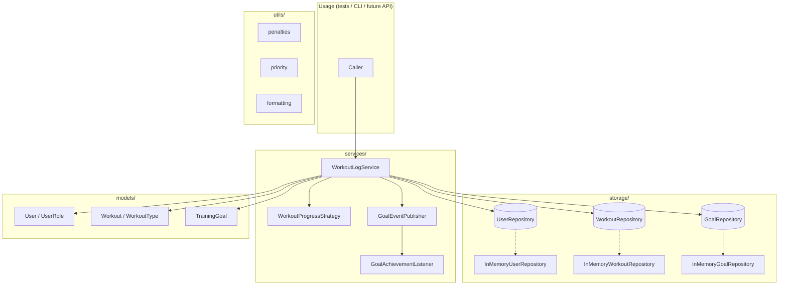

# Sport Training Service

[](https://github.com/feardelans/refactoring_proj/actions/workflows/ci-pipeline.yml?query=branch%3Amain)
[](https://sonarcloud.io/summary/new_code?id=feardelans_refactoring_proj)


In-memory backend for tracking workouts, training goals, and athlete progress. No external database or HTTP dependencies — data lives in repository instances for the lifetime of a process (ideal for demos, tests, and local tooling).

## Features

- **Workout logging** — athletes log sessions; coaches can log on behalf of an athlete.
- **Training goals** — target number of workouts with automatic progress updates after each log.
- **Flexible progress rules** — uniform or weighted scoring per workout type (Strategy pattern).
- **Goal achievements** — subscribers are notified when a goal is completed (Observer pattern).
- **Access control** — blocked users cannot log workouts; role checks for coach vs athlete.
- **Domain utilities** — streak penalty calculation and slot-queue prioritization for scheduling scenarios.

## Architecture

The codebase follows a layered design with dependency inversion: services depend on abstractions, not concrete storage.



### Layers

| Layer | Responsibility |
|-------|----------------|
| **`models`** | Domain entities and invariants (`Workout` is immutable; `TrainingGoal` validates ranges). |
| **`storage`** | `Protocol`-based repository interfaces and in-memory implementations (`dict` / `list`). |
| **`services`** | Use-case orchestration, progress strategies, and domain events. |
| **`utils`** | Pure helpers: penalties, queue ordering, string formatting. |

### Design patterns

| Pattern | Where | Purpose |
|---------|--------|---------|
| **Strategy** | `WorkoutProgressStrategy` | Swap how many progress points a workout adds to goals. |
| **Observer** | `GoalEventPublisher` / `GoalAchievementListener` | React when a goal transitions to “achieved”. |
| **Repository** | `*Repository` protocols | Decouple business logic from persistence. |

### Typical flow: log a workout

1. `WorkoutLogService` loads the acting user and validates role / blocked state.
2. The workout is persisted via `WorkoutRepository`.
3. `WorkoutProgressStrategy` computes progress points for the session.
4. Each active goal for the athlete is updated; newly achieved goals trigger `GoalAchievedEvent`.
5. Registered listeners receive the event through `GoalEventPublisher`.

## Project structure

```
refactoring_proj/
├── src/sport_training/
│   ├── models/          # User, Workout, TrainingGoal
│   ├── storage/         # Repository protocols + in-memory stores
│   ├── services/        # WorkoutLogService, policies, events
│   └── utils/           # penalties, priority, formatting
├── tests/               # Unit and integration tests (pytest)
├── .github/workflows/   # CI: tests, coverage reports, SonarCloud
├── pyproject.toml
├── Dockerfile
└── sonar-project.properties
```

## Getting started

**Requirements:** Python 3.11+

```bash
git clone https://github.com/feardelans/refactoring_proj.git
cd refactoring_proj

python3 -m venv .venv
source .venv/bin/activate          # Windows: .venv\Scripts\activate

pip install -e ".[dev]"
```

## Testing

The suite uses **pytest** with **pytest-cov**. Tests live under `tests/` and mirror the package layout: models and utils are tested in isolation; services are exercised with real in-memory repositories.

### Scope

| Type | What is tested | Examples |
|------|----------------|----------|
| **Unit** | Models, pure utils, strategies, event publisher | invalid `Workout` duration, `clamp()`, `UniformProgressStrategy`, penalty tables |
| **Integration** | `WorkoutLogService` end-to-end with `InMemory*` repos | coach logs for athlete, blocked user rejected, goal achievement events |
| **Storage** | In-memory repository behavior | save/replace, find by athlete, bulk inserts |

Roughly **350** test cases (many via `@pytest.mark.parametrize` for edge values and boundary checks).

### Test layout

```
tests/
├── test_models_goal.py           # TrainingGoal invariants and increment logic
├── test_models_user.py           # roles, blocked flag
├── test_models_workout.py        # duration and workout types
├── test_storage_goals.py         # InMemoryGoalRepository
├── test_storage_users_workouts.py
├── test_workout_log_service.py   # main use case (integration)
├── test_policy.py                # progress strategies
├── test_events.py                # GoalEventPublisher
├── test_penalties.py             # streak penalty algorithm
├── test_priority.py              # slot queue ordering
├── test_formatting_partial.py    # session summary helpers
└── test_utils_math.py            # clamp utility
```

### Running tests

Full suite with coverage and CI-style reports:

```bash
mkdir -p reports
pytest --cov=sport_training --cov-report=term-missing --cov-report=html --junitxml=reports/junit.xml
```

Quick run (no reports):

```bash
pytest
```

Run a single file or test:

```bash
pytest tests/test_workout_log_service.py
pytest tests/test_workout_log_service.py::test_log_updates_goal_and_emits_event -v
```

Parallel runs (optional, requires `pytest-xdist` from dev extras):

```bash
pytest -n auto
```

### Coverage

Branch-aware coverage is configured in `pyproject.toml` (`[tool.coverage.*]`). Current overall coverage is **~92%**; most modules under `models/`, `services/`, and `storage/` are fully covered. Partial coverage in `utils/formatting.py` is intentional — only common paths are exercised.

| Output | Description |
|--------|-------------|
| `htmlcov/index.html` | Interactive coverage browser |
| `coverage.xml` | Machine-readable coverage (CI / SonarCloud) |
| `reports/junit.xml` | Test results in JUnit format |

Open the HTML report locally:

```bash
open htmlcov/index.html          # macOS
xdg-open htmlcov/index.html      # Linux
```

### CI

Every push and pull request triggers `.github/workflows/ci-pipeline.yml`: install deps → pytest with coverage → upload `python-test-reports` artifact (`coverage.xml`, `htmlcov/`, `junit.xml`) → SonarCloud scan when `SONAR_TOKEN` is configured.

## Docker

Build and run the test suite inside a container:

```bash
docker build -t sport-training .
docker run --rm sport-training
```

## Domain model (overview)

| Entity | Description |
|--------|-------------|
| **User** | Athlete or coach; can be blocked from logging. |
| **Workout** | Dated session with duration and type (strength / cardio / flexibility). |
| **TrainingGoal** | Target number of workouts; tracks completed count toward the target. |

**Roles:** `ATHLETE` logs own workouts; `COACH` may log for any athlete.

**Utilities (standalone):**

- `missed_streak_penalty_points()` — penalty grows with streak length before a missed session.
- `sort_slot_requests()` — queue ordering by membership tier, then arrival time.

## Tech stack

- **Python 3.11+** — dataclasses, enums, `typing.Protocol`
- **pytest** + **pytest-cov** — testing and coverage
- **GitHub Actions** — continuous integration
- **SonarCloud** — static analysis and quality gate

